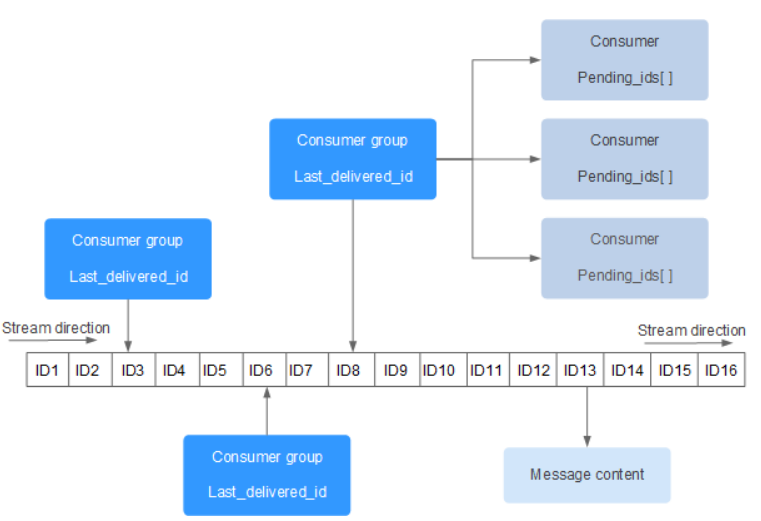

## Redis Stream
Redis Stream 是 Redis 5.0 引入的一种新的数据结构，专门用于处理消息流（消息队列）和事件流。它补充了Redis发布订阅来实现消息队列的功能，**提供了持久化和主从复制功能**，非常适合构建实时数据处理系统、日志系统、消息队列等应用。客户端可以访问任何时刻的数据，并且能够记住每一个客户端的访问位置，还能保证消息不丢失。

每个`stream`都有唯一的名称，其作为Redis的`key`，在首次使用`xadd`指令追加消息时自动创建。



上图解析:
- `Consumer Group`：消费组，使用 `XGROUP CREATE` 创建，一个消费组中有多个消费者
- `last_delivered_id`：游标，每个消费组一个，任意一个消费者读取了消息都会是游标向前移动
- `pending_ids`：消费者的状态变量，作用是维护消费者的未确认的`id`，记录了当前已被客户端读取，但是还没有ack 的消息。

### 常用命令与用法

#### 1. 添加消息 (XADD)
- **概念/功能**：向 Stream 的末尾追加一条新消息。如果 Stream 不存在，会自动创建。
- **命令格式**：`XADD key ID field value [field value ...]`
  - `ID`：消息的唯一 ID，通常用 `*` 让 Redis 自动生成（格式为“毫秒级时间戳-序列号”）。
- **使用示例**：
  ```redis
  # 向 mystream 添加一条消息，包含 name 和 age 两个字段
  XADD mystream * name "Alice" age 25
  # 成功后会返回生成的唯一 ID，例如："1680854400000-0"
  ```

#### 2. 读取消息 (XREAD)
- **概念/功能**：以阻塞或非阻塞的方式，从一个或多个 Stream 中读取消息。适合独立消费者使用。
- **命令格式**：`XREAD [COUNT count] [BLOCK milliseconds] STREAMS key [key ...] ID [ID ...]`
  - `COUNT`：限制最多读取几条消息。
  - `BLOCK`：阻塞等待的毫秒数（0 表示一直等待，直到有新消息）。
  - `ID`：从哪个 ID 之后开始读（`$` 特殊符号表示只读最新到达的消息）。
- **使用示例**：
  ```redis
  # 从 mystream 中读取开头的第一条消息
  XREAD COUNT 1 STREAMS mystream 0-0
  
  # 阻塞等待读取 mystream 的最新消息
  XREAD BLOCK 0 STREAMS mystream $
  ```

#### 3. 创建消费组 (XGROUP CREATE)
- **概念/功能**：为一个 Stream 创建一条专门的消费者组。多个消费者可以加入该组来共同分担消费消息的任务，并且支持消息应答机制。
- **命令格式**：`XGROUP CREATE key groupname id-or-$ [MKSTREAM]`
  - `id-or-$`：消费组的起始读取游标位置。`0-0` 表示从头开始消费所有历史消息；`$` 表示只消费未来最新到达的新消息。
  - `MKSTREAM`：如果指定的 Stream 不存在，自动创建出一个空 Stream。
- **使用示例**：
  ```redis
  # 创建名为 mygroup 的消费组，从头开始消费 mystream
  XGROUP CREATE mystream mygroup 0-0 MKSTREAM
  ```

#### 4. 组内读取消息 (XREADGROUP)
- **概念/功能**：作为消费组内的一员读取消息。读取后消息会进入当前消费者的“待确认（Pending）”列表，防止消息丢失。
- **命令格式**：`XREADGROUP GROUP group consumer [COUNT count] [BLOCK milliseconds] STREAMS key [key ...] ID [ID ...]`
  - `ID`：特殊符号 `>` 表示读取**从未派发**给任何组内消费者的最新消息。若是具体的 ID，则表示查阅该消费者历史读取过但未 ACK（Pending）的消息。
- **使用示例**：
  ```redis
  # 消费者 worker1 从 mygroup 组中阻塞读取最新的一条消息
  XREADGROUP GROUP mygroup worker1 COUNT 1 BLOCK 2000 STREAMS mystream >
  ```

#### 5. 确认已消费消息 (XACK)
- **概念/功能**：向消费组告知某条消息已经被成功处理完毕，系统可以将其从待确认列表中安全移除了。
- **命令格式**：`XACK key group ID [ID ...]`
- **使用示例**：
  ```redis
  # 确认已成功处理特定 ID 的消息
  XACK mystream mygroup 1680854400000-0
  ```

#### 6. 获取 Stream 长度 (XLEN)
- **概念/功能**：简单快速地返回 Stream 中当前包含的消息总数量。
- **命令格式**：`XLEN key`
- **使用示例**：
  ```redis
  XLEN mystream
  ```

#### 7. 范围查询历史记录 (XRANGE / XREVRANGE)
- **概念/功能**：按 ID 范围正序（XRANGE）或倒序（XREVRANGE）查询 Stream 中的指定消息区段数据。
- **命令格式**：`XRANGE key start end [COUNT count]`
  - `start` / `end`：特殊符号 `-` 代表最小可能的 ID，`+` 代表最大可能的 ID。
- **使用示例**：
  ```redis
  # 获取 mystream 中的所有历史消息
  XRANGE mystream - +
  ```

#### 8. 删除消息 (XDEL)
- **概念/功能**：从 Stream 中物理删除指定 ID 的消息（注意，就算移除了，之前分配给消息的 ID 也不会被二次复用）。
- **命令格式**：`XDEL key ID [ID ...]`
- **使用示例**：
  ```redis
  XDEL mystream 1680854400000-0
  ```
