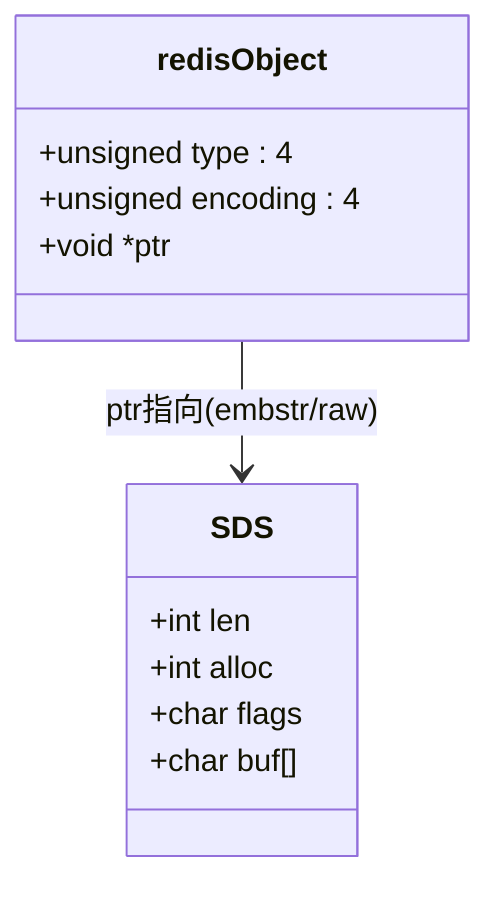
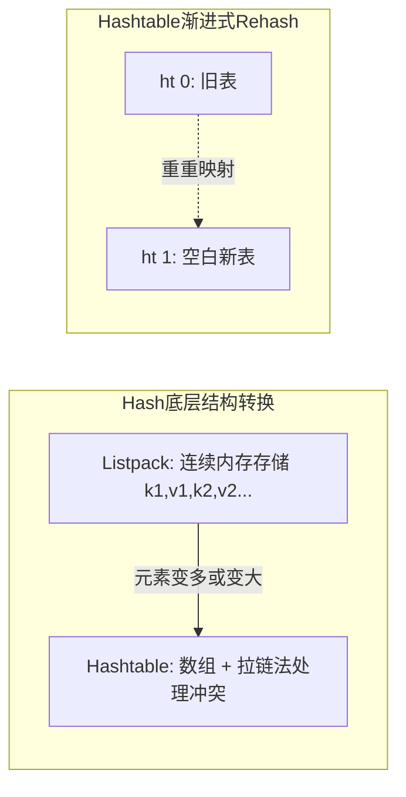
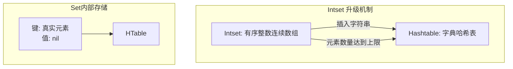
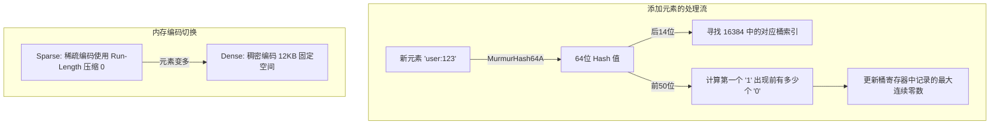

## 字符串
String 是 Redis 最基本的数据类型，Redis 的字符串是**二进制安全**的。可以在一个字符串中存储最多 **512 兆字节** 的内容。

### 二进制安全
1. 存放的是字节序列而不是文本字符串，可以包含任何数据（如图片、音频等）。
2. 不会因为特殊字符提前截断数据
3. 不依赖空字符来判断结尾，而是记录真实长度

### 底层实现
- **SDS（Simple Dynamic String）**：Redis 没有直接使用 C 语言的字符数组，而是自己封装了 SDS 结构。SDS 内部保存了字符串的真实长度（`len`）和预分配/空闲容量（`alloc/free`），这使得获取字符串长度的时间复杂度降为 `O(1)`，同时也杜绝了缓冲区溢出问题，具备了**二进制安全**的能力。
- **内部编码**：Redis 会根据字符串内容和长度自动选择最优编码格式：
	- `int`：当字符串的内容可以用 64 位范围内的有符号长整型表示时，直接用整数形式存储以节省内存。
	- `embstr`：专门用于存储短字符串的优化方式。Redis 对象结构头（`redisObject`）和底层 `SDS` 的内存空间会被连续分配，只需一次内存分配，性能更好。
	- `raw`：用于较长的字符串，对象结构头和 `SDS` 分开分配空间，需要两次内存分配，但在修改字符串时产生的碎片较少，适合大对象操作。



### 常用命令与用法

| 命令 | 功能说明 | 用法示例 |
| --- | --- | --- |
| `SET key value [EX seconds]` | 存入字符串，并可选设置过期时间（秒）。 | `SET user:1:name "Tom" EX 300` |
| `SET key value NX` | 条件写入：如果 key 不存在才执行写入操作（常用作分布式锁）。 | `SET lock:order:1001 "1" NX EX 10` |
| `GET key` | 获取指定键的值。 | `GET user:1:name` |
| `INCR / DECR` | 将存储的整数值加 1 或减 1，具有原子性。 | `INCR article:100:views` |
| `INCRBY` | 将存储的整数加减指定的增量步长。 | `INCRBY user:rank 10` |
| `GETRANGE / SETRANGE` | 获取或覆盖字符串的子串（指定偏移量）。 | `GETRANGE intro 0 5` |

### 使用场景
- 页面访问量、点赞数等原子计数
- 短期缓存（验证码、会话 token）
- 分布式锁（通常结合唯一值和 Lua 解锁）

## 哈希
哈希是键值对的集合，适合表示并存储对象。每个哈希可以存储多达 2^32 - 1 个键-值对

### 底层实现
- **listpack（紧凑列表）**：对于小规模数据（如对象字段少、长度较短的键值对），Redis 7 及以后默认使用 `listpack` 代替早期的 `ziplist`。它的实现是一块**连续内存结构**，按位保存变长的数据和元素长度信息，去除了前一个元素长度依赖，避免了连锁更新问题。内存开销极低。
- **hashtable（字典表）**：当哈希数量（`hash-max-listpack-entries`）或单字段大小（`hash-max-listpack-value`）超出了阈值时，哈希会转换成 `hashtable` 编码。底层与现代编程语言的哈希表类似，为键值结构的数组加上链表（处理冲突）。`hashtable` 实现了“渐进式 rehash”（避免阻塞主线程扩容），使得其 `HGET`、`HSET` 的平均时间复杂度依然稳定在 `O(1)`。



### 常用命令与用法

| 命令 | 功能说明 | 用法示例 |
| --- | --- | --- |
| `HSET key field value` | 为指定对象设置一个或多个字段的值。 | `HSET user:1001 name "Alice" age 20` |
| `HGET key field` | 返回指定对象的指定内部字段。 | `HGET user:1001 name` |
| `HMGET key f1 f2` | 取出一个对象中的多个指定字段的值。 | `HMGET user:1001 name age` |
| `HGETALL key` | 获取整个对象的所有字段及值（慎用大对象）。 | `HGETALL user:1001` |
| `HINCRBY key field i` | 原子性地将对象内的数值型字段自增给定的值。 | `HINCRBY user:1001 age 1` |

### 使用场景
- 用户资料、商品信息等对象型数据
- 需要按字段局部更新，避免整条 JSON 重写

## 列表
列表是字符串列表，按插入顺序排序，可以将元素添加到Redis列表的头部或尾部。列表可以包含重复元素。列表的最大长度为 2^32 – 1 个元素

### 底层实现
- **quicklist（快速链表）**：它是一种将 `双向链表 (linked list)` 和 `连续内存块 (listpack/ziplist)` 结合的高效数据结构。由于纯链表的每个节点会产生前后指针的巨大开销并带来严重的内存碎片，Redis 在使用 `quicklist` 之后，将双向链表的“每个节点”变成了一个被压缩的块（`listpack`），然后在压缩块内部连续地存储多个列表元素。
- 这极大提高了缓冲区的利用率，使得新插入的字符串元素非常快。列表的头部推入和弹出均为 `O(1)`，但中间指定索引的查询如 `LINDEX` 为 `O(n)`。

```mermaid
graph LR
    subgraph Quicklist 结构
        N1[Head Node] <--> N2[Middle Node] <--> N3[Tail Node]
    end
    
    subgraph 节点内部 (Listpack)
        LP1[元素1 | 元素2 | ... | 元素N]
    end
    
    N1 -.包含.-> LP1
```

### 常用命令与用法

| 命令 | 功能说明 | 用法示例 |
| --- | --- | --- |
| `LPUSH / RPUSH` | 在列表的最左（头部）或最右（尾部）推入一个至多元素。 | `LPUSH queue:email task1 task2` |
| `LPOP / RPOP` | 弹出列表最左/最右元素并返回它的值，结合可做栈或队列。 | `RPOP queue:email` |
| `BLPOP / BRPOP` | 阻塞式弹出命令。列表若空，连接会阻塞等待新数据，常用于秒杀抢单或简易系统。 | `BRPOP queue:email 0` |
| `LRANGE start stop` | 查看一个列表的指定区间范围元素，“-1”表示查看至尾部。 | `LRANGE queue:email 0 -1` |
| `LINDEX index` | 根据索引值查看列表某个特定下标处的元素。 | `LINDEX user:tasks 0` |

### 使用场景
- 简单消息队列（可靠性要求不高时）
- 时间线、最近操作记录

### 注意事项
- 需要消费确认、重试、死信等高级能力时，建议使用 Stream 或专业 MQ。

## 集合
集合是无序字符串集合，提供O(1)的增删查操作。集合中的元素是唯一的，不能重复。集合的最大元素数量为 2^32 – 1 个元素。

### 底层实现
- **intset（整数集合）**：当且仅当一个新集合中所有储存的元素都是整数，并且集合的记录数量比较小（受到 `set-max-intset-entries` 控制，新版通常为数百）时，Redis 会使用一种被专门优化的有序整型数组实现该类型。它可以避免使用结构复杂的哈希表，依靠二分查找保证了高效率与内存复用的最大化。
- **hashtable（字典表）**：当非整数数据（如字符串形式的 UUID）被存储或者成员数目过于巨大时，底层会透明升级为这套 `O(1)` 时间复杂度的结构。在集合中存储时，Redis Hash 表只处理“键”，其内部的相应映射“值”被强制存为特殊类型的引用对象而忽略，类似 Java 的 `HashSet` 底层依赖 `HashMap`。



### 常用命令与用法

| 命令 | 功能说明 | 用法示例 |
| --- | --- | --- |
| `SADD key value...` | 为该无序集合添加不重复的新成员。 | `SADD tag:golang user1 user2` |
| `SREM key value...` | 删除指定成员。 | `SREM tag:golang user2` |
| `SISMEMBER key x` | 快速校验某个指定的 x 是否为一个集合的成员。 | `SISMEMBER tag:golang user1` |
| `SINTER key1 k2...` | 交集查询（比如查找共同好友）。 | `SINTER tag:go tag:redis` |
| `SUNION / SDIFF` | 并集与差集运算（将全部对象展示或过滤掉被剔除的用户）。 | `SUNION set1 set2` |
| `SRANDMEMBER k [n]`| 无放回的随机选择 N 名集合的元素。常用于首页抽奖业务。 | `SRANDMEMBER lottery:pool 10` |

### 使用场景
- 标签系统、共同好友
- 去重（UV、已读用户集合）

## 有序集合
有序集合是带有分数的字符串集合，每个元素都会关联一个分数，Redis 会根据分数来排序。分数可以是任意双精度浮点数。每个有序集合可以包含最多 2^32 - 1 个元素。

### 底层实现
- **listpack（紧密打包数组）**：对于小规模成员或短内容的成员字符串分数，Redis 7 也使用它优化替代 `ziplist`，所有的分数/成员被连成了高度压实的线性分配记录。
- 对于超过该阈值的大范围且长字符串场景，**skiplist（跳跃表） + hashtable（字典）** 被一起用于实现这种复合类型：
	- `skiplist（跳跃链表）`：这是一种被巧妙设计出来的**概率型**替代平衡二叉树结构，依赖对上层索引跳跃以加快查找速度，为排行数据的各种基于分数的 `区间范围过滤（ZREVRANGEBYSCORE）` 和顺序结构扫描贡献了主要 O(log N) 的操作基础。
	- `hashtable` 负责快速进行对象映射成员分数的查找（如 `O(1)` 执行 `ZSCORE`），两者的对象引用了同一组内部字符串，既保障了排行榜的时间性能又没浪费内存空间。

```mermaid
graph LR
    subgraph 有序集合底层 (Skiplist + Hashtable)
        SL[Skiplist: 负责按分数排序\n范围查询 O(Log N)] 
        HT[Hashtable: 负责映射成员与分数\n点查 O(1)]
        
        SL .-共享对象指针-.-> 成员A
        HT .-共享对象指针-.-> 成员A
    end
    
    subgraph 跳跃表示意图
        L3层[(3级跳跃)] -->|快速过滤| Node3
        L2层[(2级跳跃)] --> Node2 --> Node3
        L1层[(单链表)] --> Node1 --> Node2 --> Node3
    end
```

### 常用命令与用法

| 命令 | 功能说明 | 用法示例 |
| --- | --- | --- |
| `ZADD key s m...` | 针对给定的键插入一组指定（分数 -> 成员）序列，可用于覆盖已有成员的相同字段。其中“s”是 Score，必须为数值。 | `ZADD rank:game 100 userA`|
| `ZRANK [REVRANK]` | `ZRANK key member`（默认由小到大排序返回元素的实际索引序号，类似排名的正数第几或者倒数榜）；`ZREVRANK` 从大到小。 | `ZREVRANK rank:game userA` |
| `ZRANGE / ZREVRANGE`| 获取按照升序（或反之）的元素的排列名次切片数组。加入 `WITHSCORES` 后连同其目前成绩一并取得。 |`ZREVRANGE rank:game 0 -1 WITHSCORES`|
| `ZINCRBY key s m` | 增加这个已知对象的对应分数的值，例如充值积分或击杀。 | `ZINCRBY rank:game 10 userA` |
| `ZSCORE key member` | 查询获得对应的 `score` 成绩而不涉及整体链表的遍历操作。 | `ZSCORE rank:game userA` |

### 使用场景
- 排行榜（积分、热度）
- 延迟任务（分数可用时间戳）
- 按权重排序推荐

## 位图
位图是字符串类型的一种特殊用法，可以将字符串视为一个连续的位数组。每个位可以是 0 或 1，适合存储大量的布尔值数据。位图的最大长度为 512 兆字节（4,294,967,296 位）。

### 底层实现
- `Bitmap` 在本质上不是一种 Redis 新加入内部数据结构类型。位图的底层实现与 **SDS 字符串**（即大字节数组）完全相同。因为 1 个字节能存放 8 位二进制状态信息而已，只要不超过字符串的最大物理极限即 `512 MB`。
- 该位运算模型通过偏移量定位（如取用户的唯一 ID / 8 找到对应的那个字节地址和它的偏移 bit），使得像 `SETBIT` 和 `GETBIT` 单点读写的命令操作达到了 `O(1)`。而大批量的 2 个用户的天数据求交（`BITOP AND`），也极其依赖位元求值在现代向量（如 `AVX` 等指令集加速或 POPCNT 等 CPU 层指令）的飞速优化计算来实现统计学操作性能。

```mermaid
graph LR
    subgraph Bitmap底层 (SDS字节)
        B1[字节 0: 01000001] -.逻辑分为.-> BIT1[bit 0~7]
        B2[字节 1: 00101111] -.逻辑分为.-> BIT2[bit 8~15]
        B1 --> B2 --> B3[字节 N ...]
    end
    
    id[用户 ID = 12] -->|公式: 12 / 8 = 字节1\n12 % 8 = 位偏移4| 位运算寻址
```

### 常用命令与用法

| 命令 | 功能说明 | 用法示例 |
| --- | --- | --- |
| `SETBIT key int v` | 向给定目标的第 N 号二进制地址里设定 0 或 1。 | `SETBIT sign:2026-04 10001 1` |
| `GETBIT k offset` | 返回这个对象记录下那个 ID 原本拥有的“0”或是“1”。 | `GETBIT sign:2026-04 10001` |
| `BITCOUNT key []`| 计数总共的已存在数据数量；计算该月的全部登录（值等于1）数量（包含选定的比特截断区）的快速查询。 | `BITCOUNT sign:2026-04` |
| `BITOP op x y1 y2` | 执行位级的与或非逻辑异或等（`AND / OR / XOR`），可以用来跨域计算日活和在线情况等。 | `BITOP AND u sign:_1 sign:_2`|

### 使用场景
- 用户签到、在线状态、开关位
- 海量布尔状态压缩存储

## HyperLogLog基数统计
HyperLogLog 是一种概率数据结构，用于估算集合中不同元素的数量（基数）。它使用固定的内存空间（通常为 12 KB）来处理大量数据，适合需要快速估算唯一元素数量的场景。HyperLogLog 的误差率约为 0.81%。

### 底层实现
- **概率统计与桶寄存器（Registers/Buckets）**：由于只需要大致地得知某个数据集合的统计规模（比如多少个人），而并不需要具体保留他所有的字段信息内容，Redis 为每次写入的信息算出一个长位元（`Hash`）的值（即 64 位），这会拿后半部的十进制数寻找相应的数组索引位置，并将计算最大零的个数作为权重的统计指标存储下来用于调和预测的均值近似算法 `Plog` 中去（通过伯努利实验的方法）。
- **稀疏表示（Sparse）与稠密表示（Dense）**：最开始该对象分配的数据使用“稀疏”模式表示这 `16384` 个不同登记数位的桶（节省内存），到了记录的数据不再有很多是 0 并长到一定量时它会升级转变为长度恒等的由 `String` 的形式记录下 `12 KB` 密集占用模式，在时间复杂度和规模扩展中寻得了最好折衷去重策略。



### 常用命令与用法

| 命令 | 功能说明 | 用法示例 |
| --- | --- | --- |
| `PFADD k elm[s...]` | 可以追加很多数据成员的记录，内部将其全部转化掉保存去重的权位。 | `PFADD uv:day_A u1 u2` |
| `PFCOUNT key...` | 合并/查寻该近似数总数的值的结果，若超过 1，会将 `HLL` 缓存计算以便快算，它的估法可能因分布稍带波动而已。 | `PFCOUNT uv:day_A` |
| `PFMERGE out k1 k2`| 为指定的数据组合并求这些对象交联而后的规模；可以聚合星期统计的量。 | `PFMERGE u:wk a b c...` |

### 使用场景
- 日活/周活 UV 统计
- 大规模唯一访客估算

### 注意事项
- 结果是估算值，不适合计费等需要精确去重的场景。

## 选型建议（速查）
- 需要简单 KV、计数器、缓存：优先 `String`
- 需要对象字段更新：优先 `Hash`
- 需要先进先出/阻塞消费：优先 `List`
- 需要去重和集合运算：优先 `Set`
- 需要按分值排序/排行榜：优先 `ZSet`
- 需要海量布尔状态：优先 `Bitmap`
- 需要低内存 UV 估算：优先 `HyperLogLog`