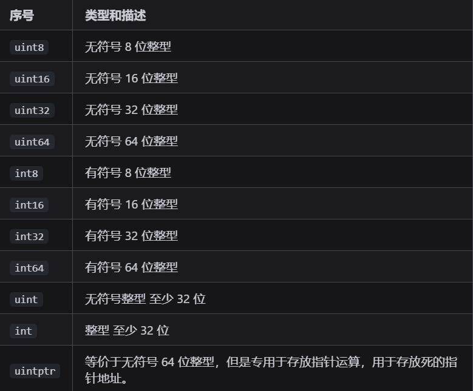
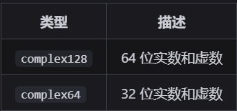
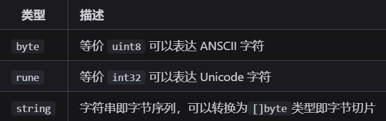
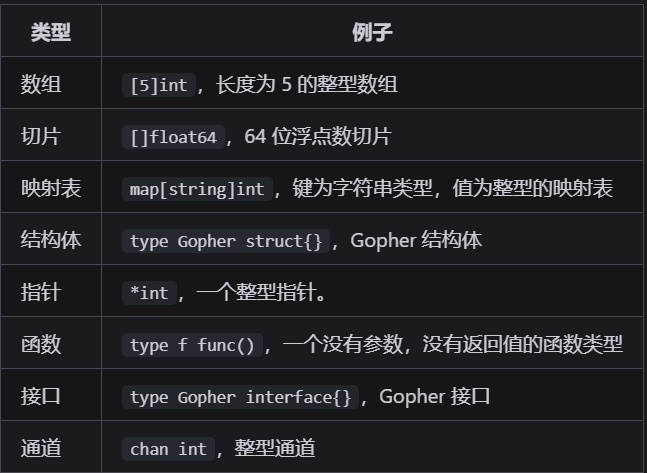
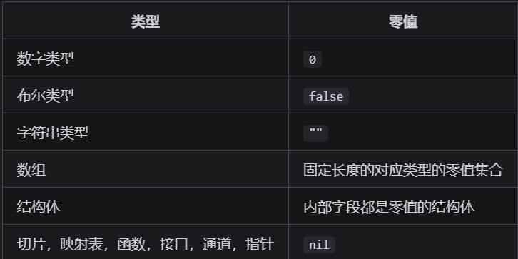

### bool
true/false（**在 Go 中，整数 0 并不代表假值，非零整数也不能代表真值，即数字无法代替布尔值进行逻辑判断，两者是完全不同的类型**）

### 整型


### 浮点型
IEEE-754浮点数，主要分为单精度浮点数与双精度浮点数


### 复数


复数使用示例：
```go
var c1 complex64 = 1 + 2i
```

### 字符
Go 完全兼容UTF-8



`byte` 可以理解为C++中的 `unsigned char`，`rune` 可以理解为C++中的 `wchar_t`

### 派生类型
Go 语言中的派生类型包括指针、数组、切片、结构体、函数、接口和通道等。



### 零值
官方文档中零值称为 `zero value`，零值并不仅仅只是字面上的数字零，而是一个类型的空值或者说默认值更为准确。



`nil` 类似C++中的 `nullptr`，表示一个空指针或者空接口等。但不完全等同，`nil`仅仅只是一些引用类型的零值，并且不属于任何类型，而 `nullptr` 是一个特殊的指针常量，属于指针类型。在Go中，`nil` 可以赋值给任何引用类型（如指针、切片、映射、通道、函数和接口），表示它们没有指向任何有效的内存地址或对象。而在C++中，`nullptr` 是一个类型安全的空指针常量，可以隐式转换为任何指针类型，但不能直接赋值给非指针类型。
```go
nil==nil // 编译错误
```